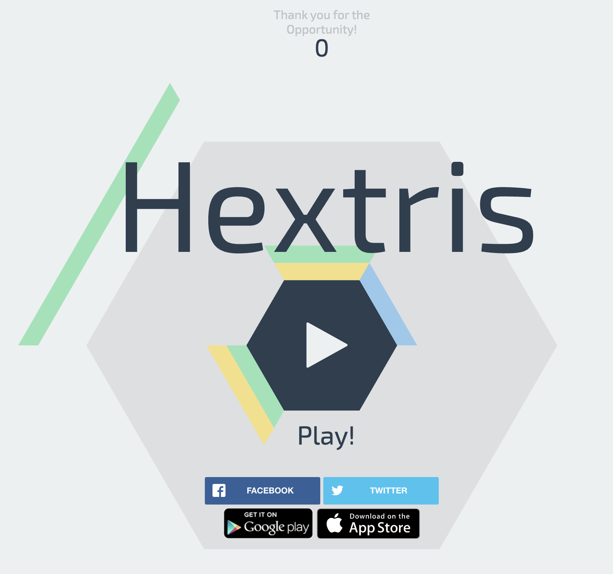

# TII Hextris Project

Solution to deploy a scalable web application.


## Diagrams


## Infrastructure Architecture


## Working Pipeline


## Suggested Pipeline Scenario


## Deployment

**1. Application:**

- Use a simple web application ([https://github.com/Hextris/hextris](https://github.com/Hextris/hextris "https://github.com/Hextris/hextris"))
- Create a Dockerfile to containerize the application.

steps:
```bash
git clone https://github.com/Hextris/hextris.git
```

Create the dockerignore:
```bash
Dockerfile
.dockerignore
.gitignore
.github/*
```


Create the dockerfile
```bash
FROM nginx:alpine

# Copy app files to the Nginx HTML directory
COPY . /usr/share/nginx/html

# Expose port 80
EXPOSE 80

# Start Nginx server
CMD ["nginx", "-g", "daemon off;"]
```


build the docker image:
```bash
docker build -t hextris-app . 
```

test the image:

```bash
docker run -it -d -p 8080:80 hextris-app
```


If you open http://localhost:8080/, you should see this:



---

**2. Kubernetes Cluster:**

- Deploy the application to a Kubernetes cluster (use Minikube, Kind, or a cloud-managed Kubernetes service like EKS, GKE, or AKS).
- Create a Deployment resource for the application with:

- At least 2 replicas.
- Resource limits (CPU and memory).

- Expose the application using a Service (ClusterIP or LoadBalancer).


First, we create the deployment that has two replicas, CPU and memory limits, limited Linux capabilities, read-only access and no ability to escalate to root:

```yaml
---
apiVersion: apps/v1
kind: Deployment
metadata:
  name: hextris-app
  labels:
    app: hextris-app
spec:
  replicas: 2
  selector:
    matchLabels:
      app: hextris-app
  template:
    metadata:
      labels:
        app: hextris-app
    spec:
      volumes:
      - name: client-temp-volume
        emptyDir: {}
      - name: proxy-temp-volume
        emptyDir: {}
      - name: fastcgi-temp-volume
        emptyDir: {}
      - name: uwsgi-temp-volume
        emptyDir: {}
      - name: scgi-temp-volume
        emptyDir: {}
      - name: var-run-volume
        emptyDir: {}
      containers:
      - name: hextris-app
        image: hextris-app:latest
        imagePullPolicy: IfNotPresent
        ports:
        - containerPort: 80
        resources:
          limits:
            cpu: "500m"
            memory: "256Mi"
          requests:
            cpu: "250m"
            memory: "128Mi"
        volumeMounts:
        - name: client-temp-volume
          mountPath: /var/cache/nginx/client_temp
        - name: proxy-temp-volume
          mountPath: /var/cache/nginx/proxy_temp
        - name: fastcgi-temp-volume
          mountPath: /var/cache/nginx/fastcgi_temp
        - name: uwsgi-temp-volume
          mountPath: /var/cache/nginx/uwsgi_temp
        - name: scgi-temp-volume
          mountPath: /var/cache/nginx/scgi_temp
        - name: var-run-volume
          mountPath: /var/run
        securityContext:
          readOnlyRootFilesystem: true
          allowPrivilegeEscalation: false
          capabilities:
            drop:
              - "ALL"
            add:
              - "CAP_CHOWN"
              - "CAP_SETGID"
              - "CAP_SETUID"
              - "CAP_NET_BIND_SERVICE"
              - "CAP_NET_RAW"
```

Secondly, we deploy the service as clusterIP, which is more secure, since it's exposed just within the cluster, but we can still use it to connect through the ingress:
```yaml
---
apiVersion: v1
kind: Service
metadata:
  name: hextris-app-service
  labels:
    app: hextris-app
spec:
  selector:
    app: hextris-app
  ports:
  - protocol: TCP
    port: 80
    targetPort: 80
  type: ClusterIP
```


If you are on Mac, install Minikube with the following:
```bash
brew install minikube
```


Then run minikube start:
```bash
minikube start
```

Run the following command to use Minikube's Docker daemon:

```bash
eval $(minikube docker-env)
```

Load the hextris image to the minikube cache to be able to be pulled by the deployment:
```bash
minikube image load hextris-app:latest
```

Now, deploy all the manifests:

```bash
kubectl apply -f manifests/deployment.yaml
kubectl apply -f manifests/service.yaml
```

---

**3. Ingress:**

- Configure an Ingress resource to expose the application externally


The ingress is configured as follows:

```yaml
---
apiVersion: networking.k8s.io/v1
kind: Ingress
metadata:
  name: hextris-app-ingress
  annotations:
    nginx.ingress.kubernetes.io/rewrite-target: /
    ingressClassName: nginx
spec:
  rules:
  - host: hextris.tii.com
    http:
      paths:
      - path: /
        pathType: Prefix
        backend:
          service:
            name: hextris-app-service
            port:
              number: 80
```

we deploy it to the cluster:
```bash
kubectl apply -f manifests/ingress.yaml
```


Enable ingress addon:
```bash
minikube addons enable ingress
```

You can now see the minikube ip with this command:
```bash
minikube ip
```

Since we are deploying everything locally, we might need to adjust our etc/hosts file to be able to access the cluster through the ingress:

```bash
sudo vim /etc/hosts

#Add this entry to the file
127.0.0.1 hextris.tii.com
```
minikube requests that you add localhost as the address there instead of minikube ip address

Make sure that tunnel is running in another terminal:
```bash
minikube tunnel
```

If everything was successfully set up, you will be able to browse it with:
```bash
http://hextris.tii.com/
```


---

**4. CI/CD Pipeline:**

- Set up a CI/CD pipeline using Jenkins
  For agents you can use  pod templates: Kubernetes plugin ([https://www.jenkins.io/doc/pipeline/steps/kubernetes/](https://www.jenkins.io/doc/pipeline/steps/kubernetes/ "https://www.jenkins.io/doc/pipeline/steps/kubernetes/"))


First Pipeline (Working):

```yaml
pipeline {
    agent {
        kubernetes {
            yaml '''
            apiVersion: v1
            kind: Pod
            spec:
              containers:
              - name: podman
                image: quay.io/podman/stable:latest
                command:
                - cat
                tty: true
                securityContext:
                  runAsUser: 0
                  privileged: true
              volumes:
              - name: podman-socket
                emptyDir: {}
            '''
        }
    }

    environment {
        GIT_REPO = 'https://github.com/RafaelM1994/tii-hextris-devops-assessment.git'
        PODMAN_IMAGE = 'hextris-app'
    }

    stages {
        stage('Checkout Code') {
            steps {
                container('podman') {
                    script {
                        git url: "${GIT_REPO}", branch: 'main'
                    }
                }
            }
        }

        stage('Build and Tag Image') {
            steps {
                container('podman') {
                    script {
                        def buildTag = "${env.BUILD_TAG}"
                        echo "Using Build Tag: ${buildTag}"
                        sh """
                            podman build -t ${PODMAN_IMAGE}:${buildTag} ./hextris
                            podman tag ${PODMAN_IMAGE}:${buildTag} ${PODMAN_IMAGE}:latest
                        """
                    }
                }
            }
        }
    }
    post {
        always {
            cleanWs()  // Clean workspace after build
        }
    }
}
```


Second pipeline:

The pipeline will do the following:


#### Checkout Code:

Uses the Docker container to clone the Git repository specified by GIT_REPO.
Retrieves the latest code from the main branch (or another branch if specified).

#### Build and Tag Docker Image:

Builds the Docker image using the Dockerfile located in the HEXTRIS_DIR.

#### Tags the image with two tags:
${BUILD_TAG}: A unique tag (typically, Jenkins sets it based on the build number or timestamp).
latest: A tag for the most recent version of the application.

#### Push Docker Image:

Authenticates with AWS Elastic Container Registry (ECR) using the AWS CLI.
Pushes the Docker image to ECR with both the ${BUILD_TAG} and latest tags.

#### Update and Apply Kubernetes Deployment:

Uses the kubectl container to update the deployment in the Kubernetes cluster:
Updates the container image for the specified deployment (${K8S_DEPLOYMENT}) with the newly built Docker image.
Restarts the deployment to apply the changes.

```yaml
pipeline {
    agent {
        kubernetes {
            yaml '''
            apiVersion: v1
            kind: Pod
            spec:
              containers:
              - name: docker
                image: docker:latest
                command:
                - cat
                tty: true
                volumeMounts:
                - mountPath: /var/run/docker.sock
                  name: docker-sock
              - name: kubectl
                image: bitnami/kubectl:latest
                command:
                - cat
                tty: true
              volumes:
              - name: docker-sock
                hostPath:
                  path: /var/run/docker.sock
            '''
        }
    }
    
    environment {
        GIT_REPO = 'https://github.com/RafaelM1994/tii-hextris-devops-assessment.git'
        HEXTRIS_DIR = 'hextris'  // Folder inside the repo to navigate into
        DOCKER_IMAGE = 'hextris-app'
        K8S_DEPLOYMENT = 'hextris-app'
        K8S_NAMESPACE = 'default'
    }

    parameters {
        string(name: 'AWS_REGION', defaultValue: 'ap-east-1', description: 'AWS region where ECR and EKS are located')
    }

    stages {
       stage('Checkout Code') {
            steps {
                container('docker') {
                    script {
                        // Checkout the GitHub repository
                        git url: "${GIT_REPO}", branch: 'main'  // Use the correct branch if needed
                    }
                }
            }
        }

        stage('Build and Tag Docker Image') {
            steps {
                container('docker') {
                    script {
                        def buildTag = "${env.BUILD_TAG}"
                        echo "Using Build Tag: ${buildTag}"
                        sh """
                            docker build -t ${DOCKER_IMAGE}:${buildTag} ./hextris
                            docker tag ${DOCKER_IMAGE}:${buildTag} ${DOCKER_IMAGE}:latest
                        """
                    }
                }
            }
        }

        stage('Push Docker Image') {
            steps {
                container('docker') {
                        def AWS_ACCOUNT = sh(script: "aws sts get-caller-identity --query 'Account' --output text", returnStdout: true).trim()
                        def REGISTRY = "${AWS_ACCOUNT}.dkr.ecr.${params.AWS_REGION}.amazonaws.com"                        
                        sh """
                            aws ecr get-login-password --region ${params.AWS_REGION} | docker login --username AWS --password-stdin ${params.REGISTRY}
                            docker push ${params.IMAGE_URI}:${BUILD_TAG}    
                        """
                    }
                }
            }
        }
        stage('Update and Apply Kubernetes Deployment') {
            steps {
                container('kubectl') {
                    script {
                        sh """
                            kubectl set image deployment/${K8S_DEPLOYMENT} ${K8S_DEPLOYMENT}=${DOCKER_IMAGE}:${BUILD_TAG} -n ${K8S_NAMESPACE}
                            kubectl rollout restart deployment/${K8S_DEPLOYMENT} -n ${K8S_NAMESPACE}
                        """
                    }
                }
            }
        }
    }
    
    post {
        always {
            cleanWs()  // Clean workspace after build
        }
    }
}
```

---

## Troubleshooting Steps:

If you are on MacOS, Make sure that tunnel is running in another terminal:
```bash
minikube tunnel
```

### **Test Connectivity with Port Forwarding**

Bypass the Service and Ingress to test directly with the Pod:

```bash
kubectl port-forward deployment/hextris-app 8080:80
```

Access the application at `http://localhost:8080`.
If this works, the issue may lie with the Service or Ingress configuration.

---

### **Test Minikube Service**

Test if the Service is accessible through Minikube:

```bash
minikube service hextris-app-service --url
```

Minikube should provide a URL (e.g., `http://<minikube-ip>:<node-port>`).
Try accessing this URL in your browser or Postman.


### **Test Internal Access**

Try to access internally first :
```bash
minikube ip

kubectl exec -it hextris-app-6889bbf754-4nzx5 -- curl -H "Host: hextris.tii.com" http://<minikube ip here>/
```

### **Test External Access**

Try to access it externally with curl:
```bash
curl -H "Host: hextris.tii.com" http://127.0.0.1/ -v
```


---


Known Issues


Unfortunately, I was not able to connect back from my agents to Jenkins:


This is the pod agent log:


It seems that port 50000 is not open on the firewall on the Jenkins side:


I also tried with websocket, it also did not work:


In the internal configuration where Jenkins is configured, it has the port 50000, that's why it works:


Proof of the agent pods being scheduled in my minikube cluster:

